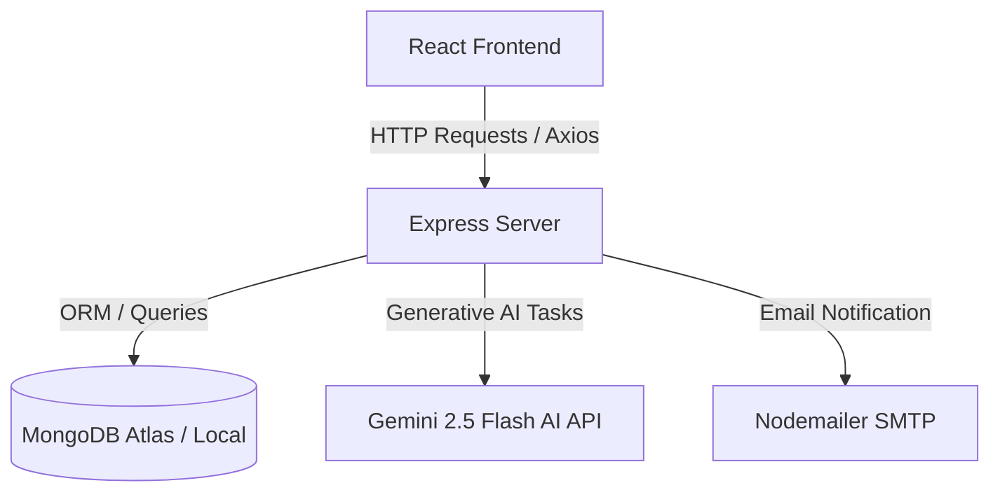

# Smart Credit Platform: Architecture & File Reference Guide

This document provides a detailed breakdown of every file in the **Smart Credit Platform** workspace. It explains how each file works, the core technologies involved, and provides theoretical examples of execution.

---

## 1. System Overview

The Smart Credit Platform is a MERN-stack application (MongoDB, Express, React, Node.js) enhanced with Gemini AI capabilities. 
* **Frontend**: Powered by React, Vite, and vanilla CSS for styling, utilizing global state contexts and modular pages/components.
* **Backend**: Powered by Node.js, Express, and Mongoose (MongoDB ODM) with services for Gemini AI integration and nodemailer SMTP email sending.



---

## 2. Root Files

### `.gitignore`
* **Purpose & Role**: Instructs Git which files and folders to ignore when tracking changes. This prevents massive folders (like `node_modules`) or sensitive keys (like `.env` containing API credentials) from being committed to public version control.
* **Key Technologies**: Git.
* **Theoretical Example**:
  If the file contains `node_modules/`, Git will completely ignore that directory when running `git status` or `git add .`.

### `README.md`
* **Purpose & Role**: The main documentation file of the repository. It introduces the project, lists system features, outlines installation steps, and documents environment variables.
* **Key Technologies**: Markdown.
* **Theoretical Example**:
  A user clones the project and reads this file to learn that they need to run `npm install` and configure a `.env` file to run the server.

---

## 3. Client-Side Files (`client/`)

### Core Configuration Files

#### `client/package.json`
* **Purpose & Role**: Holds frontend metadata, registers scripts (like `npm run dev` or `npm run build`), and lists required client dependencies.
* **Key Technologies**: Node Package Manager (NPM), Node.js.
* **Theoretical Example**:
  Running `npm run dev` triggers the script `"dev": "vite"`, starting the local Vite development server.

#### `client/vite.config.js`
* **Purpose & Role**: Configures the Vite build tool, enabling plugins like `@vitejs/plugin-react` to compile JSX.
* **Key Technologies**: Vite, ES Modules.
* **Theoretical Example**:
  When Vite bundles the app, it reads this file to understand how to compile JSX templates into plain browser-friendly Javascript.

#### `client/vercel.json`
* **Purpose & Role**: Configures Vercel-specific hosting options. It forces single-page-app routing (rewriting all requests to `/index.html`) so that React Router can handle routing without 404 errors on page refreshes.
* **Key Technologies**: Vercel Routing.
* **Theoretical Example**:
  A user refreshes their browser at `https://myapp.vercel.app/dashboard`. Instead of returning a server-side 404, Vercel redirects them to `index.html` where React Router successfully mounts `<UserDashboard />`.

#### `client/eslint.config.js`
* **Purpose & Role**: Contains code quality rules (Linter) to ensure clean code style and catch bugs early.
* **Key Technologies**: ESLint.
* **Theoretical Example**:
  If a developer leaves an unused variable in their React code, ESLint flags a warning in the editor or terminal.

#### `client/index.html`
* **Purpose & Role**: The single page load file for the application. It acts as the mounting container (`<div id="root">`) where Vite injects the compiled React application.
* **Key Technologies**: HTML5.
* **Theoretical Example**:
  The browser renders a blank canvas with a script tag pointing to `src/main.jsx`, which dynamically builds the entire user interface inside `<div id="root">`.

---

### Client Entry Files

#### `client/src/main.jsx`
* **Purpose & Role**: The Javascript entry point. It imports React, links the styling stylesheets, and renders the `<App />` component inside the root HTML element.
* **Key Technologies**: React DOM, ES Modules.
* **Theoretical Example**:
  ```javascript
  ReactDOM.createRoot(document.getElementById('root')).render(
    <React.StrictMode>
      <App />
    </React.StrictMode>
  )
  ```

#### `client/src/index.css`
* **Purpose & Role**: Implements the global design system. Contains core CSS variables (colors, fonts, glassmorphism templates) and styles for scrollbars, inputs, buttons, and animations.
* **Key Technologies**: CSS3 Custom Properties, Animations.
* **Theoretical Example**:
  Uses variables like `--neon-cyan: #00f2fe;` to apply uniform theme styling across all pages.

#### `client/src/App.css`
* **Purpose & Role**: Holds specific structural styles for layouts like card containers, landing page sections, and animated background bubbles.
* **Key Technologies**: CSS Grid, Flexbox, Keyframes.
* **Theoretical Example**:
  Creates keyframe animations that make neon gradient spheres float slowly in the background of the login page.

#### `client/src/App.jsx`
* **Purpose & Role**: The main routing hub. Wraps the app in state providers (Theme, Auth, Toast) and maps URL paths to respective page views.
* **Key Technologies**: React Router Dom, React Components.
* **Theoretical Example**:
  When a user goes to `/admin`, the React Router matches the path and mounts `<AdminDashboard />` inside the page layout wrapper.

---

### Client Contexts (Global State Management)

#### `client/src/context/AuthContext.jsx`
* **Purpose & Role**: Manages global user authentication state. It exposes methods to login, register, send OTPs, verify OTPs, and handle admin login, saving the user session in `localStorage`.
* **Key Technologies**: React Context API, Axios.
* **Theoretical Example**:
  * **Input**: User clicks "Log Out".
  * **Process**: `logout()` is called, removing the JWT token from `localStorage` and resetting the `user` state to `null`.
  * **Output**: All restricted pages automatically redirect the user to `/login`.

#### `client/src/context/ThemeContext.jsx`
* **Purpose & Role**: Toggles between light and dark themes. It updates a `data-theme` attribute on the HTML document element, allowing CSS stylesheets to swap color variables.
* **Key Technologies**: React Context API, CSS Attributes.
* **Theoretical Example**:
  * **Action**: User clicks the sun/moon icon.
  * **Process**: Theme state changes from `'dark'` to `'light'`.
  * **Output**: The document element updates to `<html data-theme="light">`, instantly shifting all background colors from dark gray to soft off-white.

---

### Client Services

#### `client/src/services/api.js`
* **Purpose & Role**: Creates a centralized Axios client instance configured with the backend API URL. It includes an interceptor that automatically attaches the user's JWT authorization token to every outgoing HTTP request header.
* **Key Technologies**: Axios interceptors, JWT, Environment Variables.
* **Theoretical Example**:
  * **Request**: Client fetches user profile from `/auth/me`.
  * **Process**: The interceptor intercepts the request, grabs the token from `localStorage`, and appends `Authorization: Bearer <token>` to the headers.
  * **Output**: The backend successfully validates the request.

---

### Client Pages

#### `client/src/pages/LandingPage.jsx`
* **Purpose & Role**: The public welcome screen. Promotes key platform details and links users to registration or credit calculation pages.
* **Key Technologies**: React, React Router.
* **Theoretical Example**:
  Renders marketing cards explaining "AI-Powered Risk Analysis" and "Real-time Loan Recommendation Engine".

#### `client/src/pages/Login.jsx`
* **Purpose & Role**: Allows normal users to log in using passwordless OTP authentication. It handles two steps: requesting the OTP and verifying it.
* **Key Technologies**: Passwordless Auth, OTP Inputs.
* **Theoretical Example**:
  * **Action**: User inputs `user@example.com` and clicks "Send Code".
  * **Process**: Calls backend OTP request; shifts interface to show a 6-digit verification code input field.

#### `client/src/pages/AdminLogin.jsx`
* **Purpose & Role**: Login page reserved for platform administrators. Uses a standard email and password input flow.
* **Key Technologies**: Form handling, Password Auth.
* **Theoretical Example**:
  Admin enters credentials. Upon validation, the Auth Context receives an admin role token and redirects the admin to the `/admin` dashboard.

#### `client/src/pages/Register.jsx`
* **Purpose & Role**: Allows new users to register. Collects the user's name and email, then triggers an OTP verification step to verify their email address.
* **Key Technologies**: React state.
* **Theoretical Example**:
  Registers an account. If successful, user is authenticated and redirected to their blank profile onboarding page.

#### `client/src/pages/UserDashboard.jsx`
* **Purpose & Role**: The home panel for normal users. Displays their credit application status, internal risk score, and recommended loan options. It hosts the Credit Score Estimator, Document OCR Upload, and Loan Simulator widgets.
* **Key Technologies**: React Hooks (`useEffect`), State Management, Axios.
* **Theoretical Example**:
  On load, it fetches the user's current application. If it finds one, it displays their approved credit limit (e.g. `$5,000`) and the AI advice explaining how that limit was calculated.

#### `client/src/pages/AdminDashboard.jsx`
* **Purpose & Role**: The administrative control tower. Allows admins to manage global risk engine variables, stress-test new limits, manage loan products, view all system applications, and review audit logs.
* **Key Technologies**: Tabs, Forms, Stress Testing Simulations, Data Tables.
* **Theoretical Example**:
  * **Action**: Admin increases the global "Min Income" rule from `$30,000` to `$40,000`.
  * **Process**: Runs a stress test on all stored applications to show how many active users would transition from "Approved" to "Rejected" under the new rules.

#### `client/src/pages/NotFound.jsx`
* **Purpose & Role**: A graceful 404 page redirecting users back to home if they navigate to an undefined URL route.
* **Key Technologies**: React Router Navigation.
* **Theoretical Example**:
  User types `https://myapp.com/unknown-page`. Renders a styled page saying "Page Not Found" with a button to return home.

---

### Client Components

#### `client/src/components/ChatbotWidget.jsx`
* **Purpose & Role**: An interactive AI chat window. Appears as a floating widget on the bottom right, allowing users to ask general credit questions.
* **Key Technologies**: React state, chat scrolling, backend streaming chat APIs.
* **Theoretical Example**:
  * **Input**: User asks "What is a Debt-to-Income ratio?".
  * **Response**: Chatbot queries the Gemini API and displays: "Debt-to-Income (DTI) ratio is your monthly debt payments divided by your monthly gross income..."

#### `client/src/components/CreditEstimator.jsx`
* **Purpose & Role**: A calculator that allows prospective users to estimate their credit rating before submitting a formal application.
* **Key Technologies**: Interactive Sliders, Formulaic calculations.
* **Theoretical Example**:
  User slides income to `$60,000` and debt to `$5,000`. The component instantly calculates their DTI ratio and displays: "Estimated Risk: Low, Estimated Limit: $7,000".

#### `client/src/components/DocumentUpload.jsx`
* **Purpose & Role**: Allows users to upload salary slips or tax documents as images. The client converts the image to base64 and posts it to the backend for AI-powered optical character recognition (OCR) and financial extraction.
* **Key Technologies**: HTML5 File Reader, Base64 conversion.
* **Theoretical Example**:
  User drags and drops `paycheck.png`. The file reader converts it to a base64 string, sends it to the server, and returns extracted annual income of `$75,000` which auto-fills the application form.

#### `client/src/components/LoanRecommendations.jsx`
* **Purpose & Role**: Displays custom loan offers that the user is qualified for based on their internal risk assessment score.
* **Key Technologies**: Conditional CSS Grid rendering.
* **Theoretical Example**:
  Renders a personal loan card highlighting a `12%` interest rate and an auto loan card with a `8.9%` interest rate.

#### `client/src/components/LoanSimulator.jsx`
* **Purpose & Role**: An interactive tool where users can simulate borrowing. Sliding amount and duration sliders recalculates the estimated interest and monthly EMI.
* **Key Technologies**: Amortization formulas in Javascript.
* **Theoretical Example**:
  User slides amount to `$10,000` for `36 months`. Shows: "EMI: $320/month, Total Interest: $1,520".

#### `client/src/components/MilestoneTracker.jsx`
* **Purpose & Role**: Renders a vertical roadmap timeline showing recommended actions for rejected or medium-risk applicants to improve their financial profile (e.g. reduce debt, maintain job tenure).
* **Key Technologies**: CSS Timeline components.
* **Theoretical Example**:
  If status is "Rejected", shows 3 milestones: "1. Reduce Debt (Target DTI < 40%)", "2. Build job history", "3. Re-apply".

#### `client/src/components/Navbar.jsx`
* **Purpose & Role**: The main navigation header. Changes links dynamically depending on whether a user, admin, or guest is logged in.
* **Key Technologies**: React State, Context integration.
* **Theoretical Example**:
  If `user.role` is `'admin'`, the navbar displays links to `Admin Panel` and `Audit Logs`. If `user.role` is `'user'`, it displays `Dashboard`.

#### `client/src/components/NotificationCenter.jsx`
* **Purpose & Role**: A drop-down menu displaying alert badges for status updates or rule notifications.
* **Key Technologies**: Timestamps, State tracking.
* **Theoretical Example**:
  User logs in and sees a badge: "Your application status was updated to Approved!".

#### `client/src/components/ProtectedRoute.jsx`
* **Purpose & Role**: A wrapper component used in React Router to protect routes. If a user is not logged in, they are redirected to the login page. It also restricts admin routes to admin roles.
* **Key Technologies**: Role-based access control (RBAC).
* **Theoretical Example**:
  ```jsx
  <ProtectedRoute adminOnly={true}>
    <AdminDashboard />
  </ProtectedRoute>
  ```
  If a normal user tries to access `/admin`, the component renders a `<Navigate to="/dashboard" />` redirect.

#### `client/src/components/ToastProvider.jsx`
* **Purpose & Role**: Custom notification system that renders alert banners (success, error, warning) at the bottom or top of the screen.
* **Key Technologies**: React Portals, Dynamic Lists.
* **Theoretical Example**:
  Upon successful application submission, calls `showToast('Application Submitted!', 'success')` causing a green floating notification to appear.

---

## 4. Server-Side Files (`server/`)

### Core Entry & Database Configuration

#### `server/package.json`
* **Purpose & Role**: Holds server metadata, startup scripts (`npm start` or `npm run dev`), and lists Node.js backend packages (Express, Mongoose, JWT, Nodemailer, Gemini AI).
* **Key Technologies**: Node Package Manager (NPM).
* **Theoretical Example**:
  Running `npm install` on the server downloads dependencies like `@google/genai` and `jsonwebtoken` into `node_modules`.

#### `server/vercel.json`
* **Purpose & Role**: Directs Vercel how to build the Node server and route incoming API endpoints to `server.js` serverless handlers.
* **Key Technologies**: Vercel Serverless Functions.
* **Theoretical Example**:
  Requests sent to `https://my-backend.vercel.app/api/auth` are routed to the Express application running in a serverless environment.

#### `server/server.js`
* **Purpose & Role**: The backend application gateway. Initializes the Express instance, establishes database connections, registers global middlewares (CORS, body-parser limits), and mounts API endpoints.
* **Key Technologies**: Express.js, Node.js, CORS.
* **Theoretical Example**:
  Listening on port `5000` waiting to receive incoming REST requests from client services.

#### `server/config/db.js`
* **Purpose & Role**: Connects the server to the MongoDB database. It features a failover system: it attempts to connect to MongoDB Atlas (cloud), and if that fails (due to network or whitelist blocks), it automatically falls back to a local offline MongoDB service.
* **Key Technologies**: Mongoose Connection, Fallback Logic.
* **Theoretical Example**:
  When the server starts, it calls `connectDB()`. If `MONGODB_URI` connection times out, it starts the local instance at `mongodb://localhost:27017/smartcredit`.

---

### Database Schemas (Mongoose Models)

#### `server/models/User.js`
* **Purpose & Role**: Defines structural rules for storing user accounts in MongoDB.
* **Key Technologies**: MongoDB Schema.
* **Fields**:
  * `name`: String (Required)
  * `email`: String (Required, Unique)
  * `role`: String (enum: `['user', 'admin']`, defaults to `'user'`)
  * `isEmailVerified`: Boolean (defaults to `false`)
  * `createdAt`: Date

#### `server/models/Application.js`
* **Purpose & Role**: Stores the user's financial profile, the calculated risk results, historical updates (to track progress over time), and the recommended loan products.
* **Key Technologies**: MongoDB Refs (linking to `User`).
* **Fields**:
  * `user`: ObjectId (References `User` model)
  * `income` / `existingDebt` / `employmentYears` / `creditScore`: Numbers
  * `riskScore` / `creditLimit`: Numbers
  * `riskLevel` / `status`: Enums (`Low/Medium/High`, `Pending/Approved/Rejected`)
  * `aiAdvice` / `pathToApproval` / `aiRecommendationSummary`: Strings
  * `recommendedLoans`: Subdocument array containing terms, EMIs, and product details.
  * `applicationHistory`: Array tracking historical financial values.

#### `server/models/Rule.js`
* **Purpose & Role**: Stores the parameters used by the credit risk engine (minimum income, maximum DTI ratio, base credit limit). Admin edits this configuration to update evaluation parameters.
* **Key Technologies**: MongoDB Document.
* **Fields**:
  * `minIncome`: Number (defaults to `30000`)
  * `maxDebtToIncomeRatio`: Number (defaults to `0.4` or `40%`)
  * `baseCreditLimit`: Number (defaults to `1000`)
  * `updatedAt`: Date

#### `server/models/OTP.js`
* **Purpose & Role**: Temporary storage for OTP registration and login verification codes.
* **Key Technologies**: Mongoose Schema.
* **Fields**:
  * `email`: String (Required)
  * `otp`: String (Required)
  * `verified`: Boolean (defaults to `false`)
  * `createdAt`: Date

#### `server/models/LoanProduct.js`
* **Purpose & Role**: Stores configured loan products (Interest rates, maximum multiplier against income, required risk margins). Users are matched with active items from this collection.
* **Key Technologies**: MongoDB Document.
* **Fields**:
  * `type`: String (e.g. `'Personal Loan'`, `'Home Loan'`)
  * `icon`: String (lucide-react icon name)
  * `maxAmountFactor`: Number (Multiplier, e.g. `0.5` or `5.0`)
  * `baseInterestRate`: Number (Interest percentage, e.g. `8.5`)
  * `tenure`: String
  * `minRiskScore` / `minIncome` / `minEmploymentYears`: Eligibility boundaries
  * `features`: Array of strings
  * `isActive`: Boolean (Toggled by admin)

#### `server/models/AuditLog.js`
* **Purpose & Role**: Tracks administrative actions for accountability and security. Every time rules change or loan products are deleted, an entry is written here.
* **Key Technologies**: MongoDB Indexes (for fast date query sorting).
* **Fields**:
  * `admin`: ObjectId (References the `User` who acted)
  * `action`: String (e.g. `'UPDATE_RULES'`, `'STRESS_TEST'`)
  * `target`: String
  * `details`: Mixed (flexible JSON storing before/after states)
  * `createdAt`: Date

---

### Backend Middleware

#### `server/middleware/authMiddleware.js`
* **Purpose & Role**: Intercepts request headers, parses the JWT authentication token, decrypts the payload, retrieves user profile metadata, and attaches `req.user` to downstream routing handles. It also validates admin-only permissions.
* **Key Technologies**: jsonwebtoken, HTTP Headers.
* **Theoretical Example**:
  * **Input**: Request header `Authorization: Bearer <token>`.
  * **Process**: `jwt.verify(token, JWT_SECRET)` returns user ID `{id: "123", role: "admin"}`.
  * **Output**: User profile matches, request allowed to pass to `adminController.js` via `next()`.

---

### Backend Controllers (Business Logic)

#### `server/controllers/authController.js`
* **Purpose & Role**: Manages authentication workflows. It handles OTP creation/sending, OTP code verification, and generating/returning signed JWT tokens. It also processes admin password logins.
* **Key Technologies**: Cryptography, JWT generation, Nodemailer integrations.
* **Theoretical Example**:
  * **Action**: User inputs email.
  * **Process**: Controller generates `542891`, deletes prior OTP files for that email, creates a new Mongoose OTP document, and calls `sendOTP()` to mail the code.

#### `server/controllers/applicationController.js`
* **Purpose & Role**: Processes financial applications. Evaluates income/debt values against active Rule models to calculate a risk score (0-100). Coordinates with Gemini AI services to generate credit summaries, improvement roadmaps, and matching loan products.
* **Key Technologies**: Mathematical calculation models, AI prompt compilation.
* **Theoretical Example**:
  An applicant with `$50,000` income, `$10,000` debt (DTI: 0.2), and `3` years job history gets:
  * Base score: `50`
  * Income bonus: `+20` (since `$50k > $30k`)
  * Debt bonus: `+20` (since `DTI 0.2 < 0.4`)
  * Employment bonus: `+10` (since `3 > 2` years)
  * **Final Risk Score**: `100` (Low Risk, Approved status).

#### `server/controllers/adminController.js`
* **Purpose & Role**: Orchestrates administrative dashboard commands. Allows retrieving and editing evaluation rules, managing active loan products, and analyzing how custom rules affect current users.
* **Key Technologies**: Database Aggregations, Audit Logging.
* **Theoretical Example**:
  Admin edits the minimum income rule. The controller updates the rules document, logs a `'UPDATE_RULES'` action under the `AuditLog` model, and saves the previous states.

#### `server/controllers/chatController.js`
* **Purpose & Role**: Coordinates request messages and passes conversation payloads to Gemini AI.
* **Key Technologies**: Express HTTP controllers.
* **Theoretical Example**:
  Receives `{message: "Hi"}` from user, forwards it to `aiService.js`, and returns `{reply: "Hello! How can I help..."}`.

#### `server/controllers/documentController.js`
* **Purpose & Role**: Sanitizes base64 string headers from file uploads and triggers document analytics processes.
* **Key Technologies**: Regular expressions, string formatting.
* **Theoretical Example**:
  A file string `data:image/png;base64,iVBORw0...` is stripped of its prefix to obtain raw base64 data, then passed to the OCR analyzer.

---

### Backend Services

#### `server/services/aiService.js`
* **Purpose & Role**: The AI engine. Communicates with Google's Gemini API (`gemini-2.5-flash`). It handles document OCR, conversational queries, structured risk descriptions, path-to-approval roadmaps, and personalized loan recommendations. If no API key exists, it automatically falls back to clean, predictable mock JSON data.
* **Key Technologies**: `@google/genai` SDK, Prompt engineering, JSON parsing.
* **Theoretical Example**:
  Sends a structured prompt containing the applicant's variables to Gemini. The model returns a JSON string, which is parsed and saved as structural fields in the database.

#### `server/services/emailService.js`
* **Purpose & Role**: Sends transactional security emails. Uses Nodemailer to configure an SMTP connection to Gmail and emails branded HTML code blocks.
* **Key Technologies**: Nodemailer SMTP, HTML Email Templates.
* **Theoretical Example**:
  Nodemailer authenticates with `SMTP_EMAIL` and sends an email to the customer with an HTML block rendering a secure blue-tinted card containing their 6-digit OTP code.

---

### Backend Routes (Endpoint Definitions)

#### `server/routes/auth.js`
* **Purpose & Role**: Defines API endpoints for authentication (`/send-otp`, `/verify-otp`, `/admin-login`, `/me`).
* **Key Technologies**: Express Router.
* **Theoretical Example**:
  `router.post('/send-otp', sendLoginOTP)` maps POST requests to the OTP handler.

#### `server/routes/application.js`
* **Purpose & Role**: Defines credit application endpoints (`/`, `/me`, `/history`, `/simulate`, `/estimate`).
* **Key Technologies**: Express Router.
* **Theoretical Example**:
  `router.get('/history', protect, getApplicationHistory)` matches GET requests from authenticated users.

#### `server/routes/admin.js`
* **Purpose & Role**: Registers endpoints restricted to administrators (user lists, rule updates, audit logs, stress tests, loan products CRUD).
* **Key Technologies**: Express Router.
* **Theoretical Example**:
  `router.put('/rules', protect, admin, updateRules)` ensures that only requests verified as admins can update the parameters.

#### `server/routes/chat.js`
* **Purpose & Role**: Maps `/api/chat` to `handleChat`.
* **Key Technologies**: Express Router.
* **Theoretical Example**:
  `router.post('/', protect, handleChat)` processes chatbot inquiries.

#### `server/routes/document.js`
* **Purpose & Role**: Maps `/api/documents/upload` to the document analyzer.
* **Key Technologies**: Express Router.
* **Theoretical Example**:
  `router.post('/upload', protect, uploadDocument)` uploads a base64 image.

---

### Development Support Scripts

#### `server/test.js`
* **Purpose & Role**: A developer test script that simulates user registration, login, and application submissions. Useful for testing endpoints in local terminal environments.
* **Key Technologies**: Axios, Node.js command line.
* **Theoretical Example**:
  Executing `node test.js` automatically performs a POST request registering a test user, logging in, and submitting dummy financial figures.
